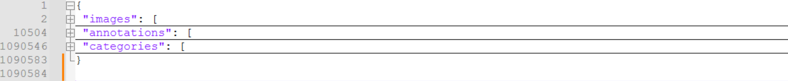
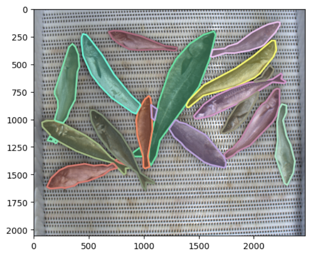
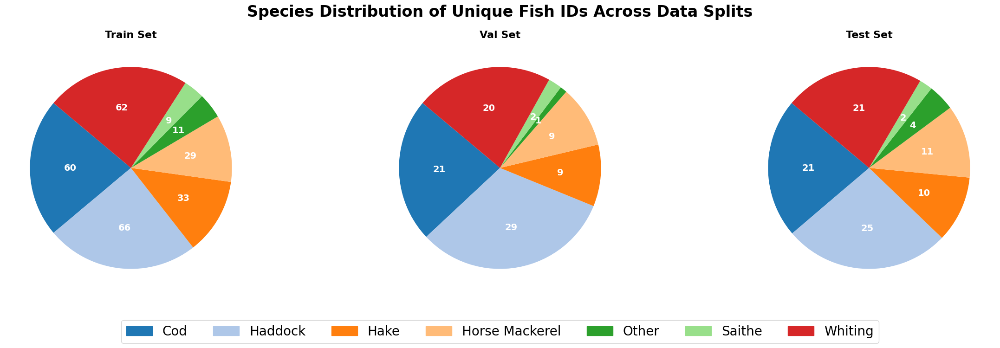
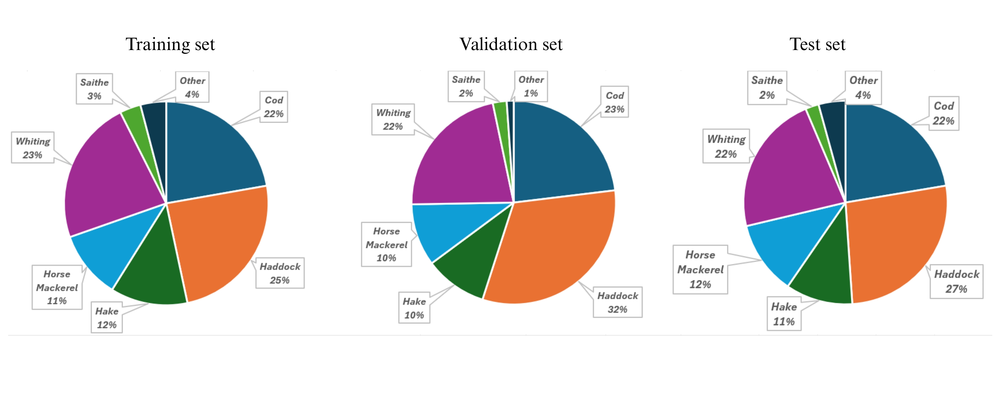

## **Dataset Structure for COCO Annotations in AutoFish data**

<a href="https://huggingface.co/datasets/vapaau/autofish" target="_blank">
    
</a>


This dataset consists of **1,500 images** organized into **24 folders**, named sequentially as:  
`group_01, group_02, ..., group_24`.  

Each folder contains multiple images, but **all images within a folder start with the filename `00001.png`**. Despite identical file names across folders, **each image has a unique image ID** for identification.

---


## **Dataset Organization**
The dataset follows the **COCO JSON format**, containing three main sections:


### **1. Images**
Each image entry includes:
- `id`: A unique image identifier  
- `file_name`: The relative path, e.g., `"group_01/00001.png"`  
- `height`: Image height  
- `width`: Image width  
- `group`: The folder to which the image belongs  

Example:
```json
"images": [
  {
   "height": 2056,
   "width": 2464,
   "id": 1,
   "file_name": "group_01/00001.png",
   "group": 1
  },
  {
   "height": 2056,
   "width": 2464,
   "id": 2,
   "file_name": "group_01/00002.png",
   "group": 1
  }
]
```
### **2. Annotations**
Each annotation entry includes:
- `image_id`: A unique image identifier  
- `bbox`: The bounding box coordinates  
- `segmentation`: segmentation mask coordinates  
- `category_id`: Iclass id of the objects (fish)  
- `glength`: Total length of the fish
- `fish_id`: TUnique id for each fish in the images
- `side_up`: Side of the fish whether it is left or right
- `id` : Segmentation mask ID
- `area`: Area of the object covered

Example
```json
"annotations": [
  {
   "iscrowd": 0,
   "image_id": 1,
   "bbox": [
    381.0,
    1123.0,
    822.0,
    378.0
   ],
   "segmentation": [
    [
     1192,
     1501,
     1110,
     1477,
     1038,
     1437,
     872,
     1417,
     594,
     1323,
     482,
     1263,
     393,
     1176,
     381,
     1142,
     430,
     1123,
     498,
     1123,
     800,
     1233,
     888,
     1285,
     1048,
     1415,
     1196,
     1439,
     1203,
     1448,
     1183,
     1480
    ]
   ],
   "category_id": 0,
   "length": 35.5,
   "fish_id": 316,
   "side_up": "R",
   "id": 1,
   "area": 92164
  }
]
```
### **3. Categories**
Each annotation entry includes:
- `id`: A unique class identifier  
- `name`: Name of the class  
- `supercategory`: super category of classes

```json
"categories": [
  {
   "id": 0,
   "name": "horse_mackerel",
   "supercategory": "horse_mackerel"
  },
  {
   "id": 1,
   "name": "whiting",
   "supercategory": "whiting"
  },
  {
   "id": 2,
   "name": "haddock",
   "supercategory": "haddock"
  },
  {
   "id": 3,
   "name": "cod",
   "supercategory": "cod"
  },
  {
   "id": 4,
   "name": "hake",
   "supercategory": "hake"
  },
  {
   "id": 5,
   "name": "saithe",
   "supercategory": "saithe"
  },
  {
   "id": 6,
   "name": "other",
   "supercategory": "other"
  }
 ]
}

```
 


# Data exploration using python

<h2>pycocotools</h2>

Install Pycocotools
```python

pip install pycocotools
```
After installation, you can get to know about the functions in the library
```python
help(COCO)
```
To see a specific function
```python
help(COCO.loadCats)
```

Importing the dataset
```python
from pycocotools.coco import COCO

annotation = 'path/to//annotations.json'
coco = COCO(annotation)
```
getting category ID and category name
```python

categories = [(category['id'],category['name']) for category in categories]
print(categories)
```

A specific category iD
```python
cat_es = coco.getCatIds(catNms=['whiting'])
print(cat_es)
```

Get the sequence of image IDs
```python
img_ids = coco.getImgIds()
print(img_ids)
```

**Annotation ID**

getAnnIds() function is crucial for extracting specific annotation IDs that match certain image IDs, category IDs or other criteria

**What does it do?**

it retrieves annotation ids that satisft the given conditions


> ann_ids = coco.getAnnIds(imgIds=[10, 20], catIds=[1, 2], iscrowd=None)

here filters annotations for images with ID 10 and 20, filters annotations belonging to categories 1 and 2, igores the annotations marked as crowd


Get annotation IDs for objects larger than 1000 pixels in area
```python
ann_ids_large = coco.getAnnIds(areaRng=[1000, float('inf')])
annotations_large = coco.loadAnns(ann_ids_large)
print(f"Total large annotations: {len(annotations_large)}")
```

knowing the annotation structure of the annotation.json file
```python
img_ID = 2
ann_ids = coco.getAnnIds(imgIds=[img_ID])
annotations = coco.loadAnns(ann_ids)
print(annotations[0])
```
Result
```
{
  'iscrowd': 0,
  'image_id': 2,
  'bbox': [79.0, 479.0, 196.0, 892.0],
  'segmentation': [[140, 1371, 110, 1369, 101, 1346, 143, 1188, 129, 1068, 85, 982, 79, 912, 97, 688, 115, 616, 157, 502, 190, 479, 217, 514, 263, 652, 275, 844, 239, 1146, 197, 1210, 185, 1280],
  'category_id': 1,
  'length': 36.0,
  'fish_id': 419,
  'side_up': 'L',
  'id': 9,
  'area': 111561
  }

```


Visualizing an image with its segmentation masks
```python
import matplotlib.pyplot as plt
import cv2

img_id = 166 #this is the annotation image id in a spefic group, just define it then in later steps it will find the image
image_info = coco.loadImgs(img_id)[0]
print(image_info)

#path to the main folder with all the subfolders in the autofish (groups)
image_path = f"/content/drive/MyDrive/Thesis/autofish/{image_info['file_name']}"


#reading the image
image = cv2.imread(image_path)

# Check if the image was loaded correctly
if image is None:
    raise FileNotFoundError(f"Image not found at path: {image_path}")

ann_ids = coco.getAnnIds(imgIds=[img_id])
annotations = coco.loadAnns(ann_ids)

image = cv2.cvtColor(image, cv2.COLOR_BGR2RGB)
plt.imshow(image)
coco.showAnns(annotations)
plt.show()

```




For visualizing multimple images with their bounding boxes and segmentation masks
```python
import matplotlib.pyplot as plt       #displaying images
import matplotlib.patches as patches  #drawing bounding boxes
import cv2                            #read and process images

#defining multiple selected images
img_ids = [2, 50, 250, 500, 750, 1000]

#getting metadata for the selected images
image_infos = coco.loadImgs(img_ids)

for image_info in image_infos:
    #image path (main path to the autofish directory)
    image_path = f"/work3/msam/Thesis/autofish/{image_info['file_name']}"

    #Reading image
    image = cv2.imread(image_path)

    #confirm the image read correctly
    if image is None:
        print(f"Warning: Image not found at {image_path}")
        continue

    #Resize image to COCO's recorded dimensions
    image = cv2.resize(image, (image_info['width'], image_info['height']))
    #adjusting the color profiles to RGB
    image = cv2.cvtColor(image, cv2.COLOR_BGR2RGB)

    #Get annotations for this image
    ann_ids = coco.getAnnIds(imgIds=[image_info['id']])
    annotations = coco.loadAnns(ann_ids)

    #Debug: Check if annotations belong to the correct image
    print(f"Annotations for Image {image_info['id']}: {ann_ids}")

    #Plot Image
    fig, ax = plt.subplots(figsize=(8, 6))
    ax.imshow(image)

    #Plot Bounding Boxes
    for ann in annotations:
        bbox = ann['bbox']
        x_min, y_min, width, height = bbox
        rect = patches.Rectangle(
            (x_min, y_min), width, height, linewidth=1, edgecolor='y', facecolor='none'
        )
        ax.add_patch(rect)

    #Show Annotations using COCO
    coco.showAnns(annotations)
    plt.axis("off")
    plt.title(f"Image ID: {image_info['id']}")
    plt.show()

```
# Using pycocotools to explore the COCO JSON files

Loading the dataset in to memory
```python
from pycocotools.coco import COCO

# Replace with your annotations JSON path
annotation_file = f'/work3/msam/Thesis/autofish/annotations.json'

# Initialize the COCO object
coco = COCO(annotation_file)

# Get the list of all annotation IDs
ann_ids = coco.getAnnIds()

# Load all annotations
anns = coco.loadAnns(ann_ids)

print("Total annotations (bounding boxes/segmentations):", len(anns))

# Collect unique fish_ids
unique_fish_ids = set()
for ann in anns:
    if "fish_id" in ann:
        unique_fish_ids.add(ann["fish_id"])

print("Number of unique fish (fish_id):", len(unique_fish_ids))

```
# Exploring the content of the dataset

1. Species composition
2. Unique fish ID per species
3. segmentation masks per folder split (train, val and test)


```python
import collections
from pycocotools.coco import COCO

# --- 1. Initialization ---

# Replace with your annotations JSON path
annotation_file = f'/work3/msam/Thesis/autofish/annotations.json'

# Initialize the COCO object
try:
    coco = COCO(annotation_file)
    print(f"Successfully loaded annotations from: {annotation_file}")
except Exception as e:
    print(f"Error loading COCO file: {e}")
    exit()

# Define the train/val/test splits based on your group IDs
train_group_ids = {2, 3, 4, 5, 7, 8, 9, 12, 13, 15, 16, 18, 19, 23, 24}
val_group_ids = {1, 6, 11, 17, 25}
test_group_ids = {10, 14, 20, 21, 22}

print(f"\nUsing pre-defined split for {len(train_group_ids)} train, {len(val_group_ids)} val, and {len(test_group_ids)} test groups.")


# --- 2. Data Preparation ---

# Create a mapping from category ID to species name
category_map = {cat['id']: cat['name'] for cat in coco.dataset['categories']}

# *** NEW: Create a mapping from image ID to group ID for efficient lookup ***
image_to_group_map = {img['id']: img['group'] for img in coco.dataset['images']}

# Prepare data structures to hold our statistics
species_annotation_counts = collections.defaultdict(int)
species_unique_fish = collections.defaultdict(set)
split_counts = {'train': 0, 'val': 0, 'test': 0, 'unassigned': 0}


# --- 3. Process All Annotations ---

all_annotations = coco.dataset['annotations']

for ann in all_annotations:
    if "category_id" not in ann or "fish_id" not in ann or "image_id" not in ann:
        continue
        
    category_id = ann['category_id']
    fish_id = ann['fish_id']
    image_id = ann['image_id']
    
    species_name = category_map.get(category_id, 'Unknown')

    # Count species and unique fish (this logic is unchanged)
    species_annotation_counts[species_name] += 1
    species_unique_fish[species_name].add(fish_id)

    # *** CORRECTED LOGIC: Use the group ID for splitting ***
    group_id = image_to_group_map.get(image_id)
    
    if group_id in train_group_ids:
        split_counts['train'] += 1
    elif group_id in val_group_ids:
        split_counts['val'] += 1
    elif group_id in test_group_ids:
        split_counts['test'] += 1
    else:
        split_counts['unassigned'] += 1


# --- 4. Display Results ---

print("\n" + "="*50)
print("      Full Dataset Composition Report (Corrected)")
print("="*50 + "\n")

# Report 1: Species Composition
print("--- Species Composition (Total Masks) ---")
for species, count in sorted(species_annotation_counts.items()):
    print(f"{species:<20} | {count:>5} masks")
print("-"*38 + "\n")

# Report 2: Unique Fish per Species
print("--- Unique Fish IDs per Species ---")
for species, fish_ids_set in sorted(species_unique_fish.items()):
    count = len(fish_ids_set)
    print(f"{species:<20} | {count:>5} unique fish")
print("-"*38 + "\n")

# Report 3: Segmentation Masks per Split
print("--- Segmentation Masks per Split (group_01s) ---")
total_assigned = 0
for split, count in split_counts.items():
    if split != 'unassigned':
        total_assigned += count
    print(f"{split.capitalize():<20} | {count:>5} masks")

# Sanity check
print("-"*38)
print(f"{'Total Assigned':<20} | {total_assigned:>5} masks")
print(f"{'Total in Dataset':<20} | {len(all_annotations):>5} masks")
if split_counts['unassigned'] > 0:
    print(f"\nWarning: Found {split_counts['unassigned']} masks from groups that are not in any split!")

print("\n" + "="*50)

```

## output

```text
Using pre-defined split for 15 train, 5 val, and 5 test groups.

==================================================
      Full Dataset Composition Report (Corrected)
==================================================

--- Species Composition (Total Masks) ---
cod                  |  4079 masks
haddock              |  4761 masks
hake                 |  2080 masks
horse_mackerel       |  1960 masks
other                |   640 masks
saithe               |   520 masks
whiting              |  4118 masks
--------------------------------------

--- Unique Fish IDs per Species ---
cod                  |   102 unique fish
haddock              |   119 unique fish
hake                 |    52 unique fish
horse_mackerel       |    49 unique fish
other                |    16 unique fish
saithe               |    13 unique fish
whiting              |   103 unique fish
--------------------------------------

--- Segmentation Masks per Split (group_01s) ---
Train                | 10760 masks
Val                  |  3639 masks
Test                 |  3759 masks
Unassigned           |     0 masks
--------------------------------------
Total Assigned       | 18158 masks
Total in Dataset     | 18158 masks


```

# Generating piecharts for each folder split (train, val and test)

In here the number of fish_IDs per each split is determined and the percentage composition of the species are explored.
The Autofish dataset has defined folder splits in order to have the similar species composition in all three splits to increase the robustness in model training and validation.

```python
import collections
import matplotlib.pyplot as plt
import matplotlib.patches as mpatches
from pycocotools.coco import COCO

# --- 1. Initialization (No changes here) ---
annotation_file = f'/work3/msam/Thesis/autofish/annotations.json'
try:
    coco = COCO(annotation_file)
    print(f"Successfully loaded annotations from: {annotation_file}")
except Exception as e:
    print(f"Error loading COCO file: {e}")
    exit()

train_group_ids = {2, 3, 4, 5, 7, 8, 9, 12, 13, 15, 16, 18, 19, 23, 24}
val_group_ids = {1, 6, 11, 17, 25}
test_group_ids = {10, 14, 20, 21, 22}
print(f"\nUsing pre-defined split for {len(train_group_ids)} train, {len(val_group_ids)} val, and {len(test_group_ids)} test groups.")

# --- 2. Data Preparation (No changes here) ---
category_map = {cat['id']: cat['name'] for cat in coco.dataset['categories']}
image_to_group_map = {img['id']: img['group'] for img in coco.dataset['images']}
all_species_names = sorted(category_map.values())
palette = plt.get_cmap('tab20') 
color_map = {species: palette(i) for i, species in enumerate(all_species_names)}
split_species_fish_ids = {
    'train': collections.defaultdict(set),
    'val': collections.defaultdict(set),
    'test': collections.defaultdict(set)
}

# --- 3. Process All Annotations (No changes here) ---
all_annotations = coco.dataset['annotations']
for ann in all_annotations:
    if "category_id" not in ann or "fish_id" not in ann or "image_id" not in ann:
        continue
    category_id = ann['category_id']
    fish_id = ann['fish_id']
    image_id = ann['image_id']
    species_name = category_map.get(category_id, 'Unknown')
    group_id = image_to_group_map.get(image_id)
    current_split = None
    if group_id in train_group_ids:
        current_split = 'train'
    elif group_id in val_group_ids:
        current_split = 'val'
    elif group_id in test_group_ids:
        current_split = 'test'
    if current_split:
        split_species_fish_ids[current_split][species_name].add(fish_id)

# --- 4. Generate Combined Figure with Subplots and Legend (MODIFIED SECTION) ---
print("\nGenerating combined figure with subplots and a shared legend...")

# *** NEW: Create a figure with 1 row and 3 columns for the charts ***
fig, axes = plt.subplots(1, 3, figsize=(24, 8))
fig.suptitle('Species Distribution of Unique Fish IDs Across Data Splits', fontsize=24, weight='bold')

def make_autopct(values):
    def my_autopct(pct):
        total = sum(values)
        val = int(round(pct*total/100.0))
        return f'{val}'
    return my_autopct

# Loop through the axes and splits to draw each pie chart
for ax, split_name in zip(axes, ['train', 'val', 'test']):
    species_data = split_species_fish_ids[split_name]
    
    labels = []
    sizes = []
    chart_colors = []
    
    for species, fish_ids_set in sorted(species_data.items()):
        labels.append(species.replace("_", " ").title())
        sizes.append(len(fish_ids_set))
        chart_colors.append(color_map[species])
        
    if not sizes:
        ax.text(0.5, 0.5, 'No data', horizontalalignment='center', verticalalignment='center')
        ax.set_title(f'{split_name.capitalize()} Set', fontsize=16, weight='bold')
        ax.axis('off')
        continue

    # Create the pie chart on the specific subplot axis (ax)
    # *** MODIFIED: Increased font size in textprops ***
    ax.pie(sizes, autopct=make_autopct(sizes), startangle=140, colors=chart_colors,
           textprops={'fontsize': 14, 'weight': 'bold', 'color': 'white'})
    
    ax.set_title(f'{split_name.capitalize()} Set', fontsize=16, weight='bold')

# *** NEW: Create and add a shared legend at the bottom ***
legend_handles = [mpatches.Patch(color=color_map[species], label=species.replace("_", " ").title()) for species in all_species_names]
fig.legend(handles=legend_handles, loc='lower center', ncol=len(all_species_names), fontsize=20, bbox_to_anchor=(0.5, 0.05))

# Adjust layout to make room for the suptitle and legend
plt.tight_layout()
fig.subplots_adjust(top=0.88, bottom=0.2) # Adjust top for suptitle, bottom for legend

# Save the combined figure
file_name = 'species_distribution_combined.png'
plt.savefig(file_name, bbox_inches='tight') # bbox_inches='tight' ensures the legend isn't cut off
plt.show()

print(f"\nSaved combined chart to {file_name}")
print("Analysis complete.")

```


