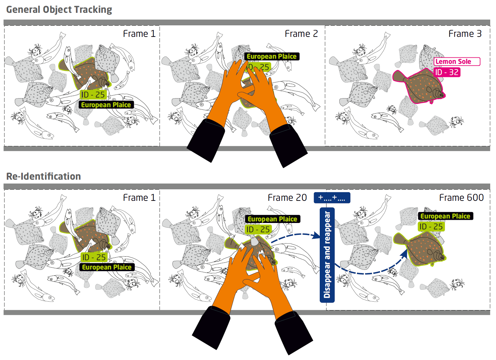
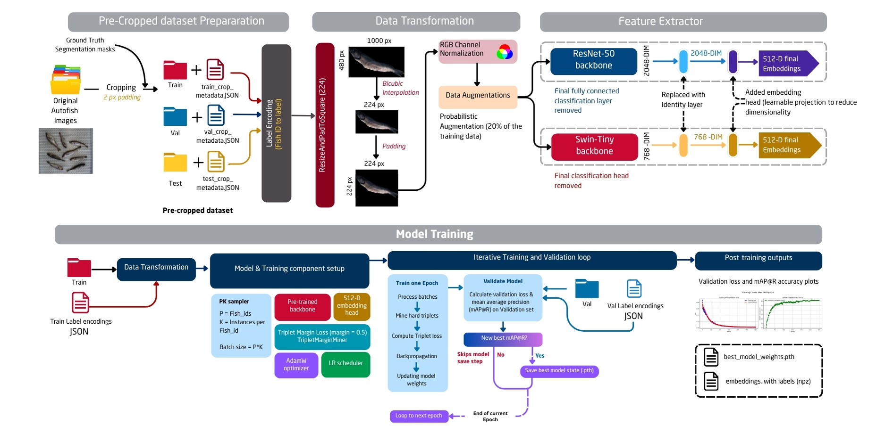
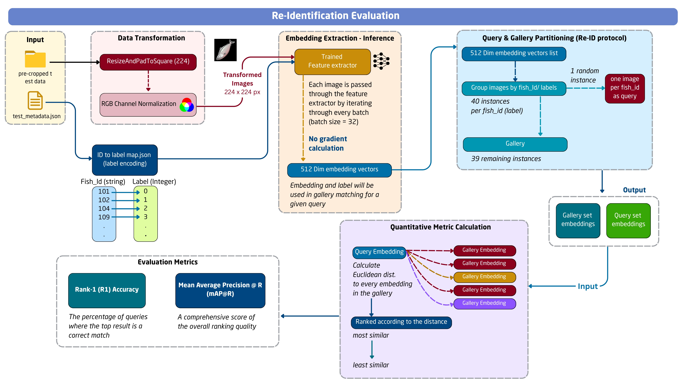
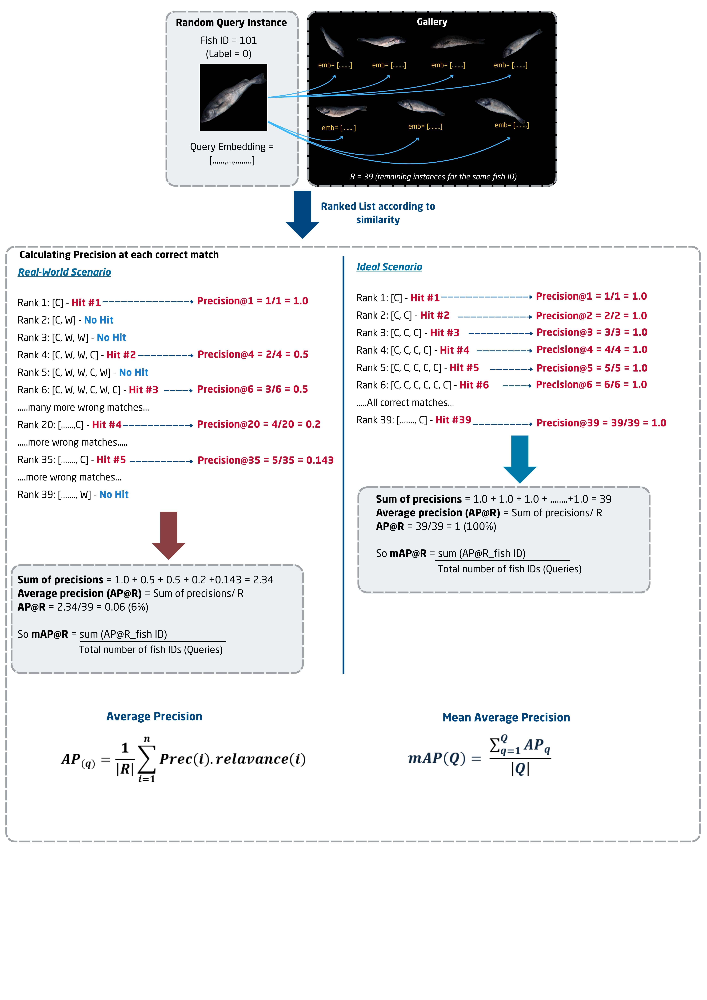

# What is fish Re-ID in Fisheries?

There are many persistent challenges in current deep learning approaches, particularly in distinguishing between visually similar individuals of the same species and consistently tracking unique fish in dynamic catch scenarios. This specific limitation significantly hinders precise quantification, which is crucial for accurate stock assessments and discard monitoring. 

Re-identification (Re-ID) offers a powerful solution, proving highly useful in automated fish catch sorting on conveyor belts. It enables systems to assign and maintain a persistent, unique identity for each catch item. This capability allows for consistent recognition and tracking, even when fish overlap, bend, lose the view for some frames in a video sequence due to occlusion, or move between different camera views, which are everyday situations on busy sorting conveyor belts.

The fundamental contribution of Re-Id towards accurate catch quantification lies in its ability to ensure accurate individual data association. By maintaining a stable ID, all relevant data points captured throughout the image acquisition area, such as species and length measurement, can be linked to the correct individual fish. This prevents data fragmentation and errors like double-counting or misclassifying fish, leading not only to more precise sorting and grading but also a trustworthy foundation for catch quantification. For instance, more advanced Re-ID systems, often utilizing segmentation masks and deep neural networks, can correctly associate different visible parts of the fish body with the same individual, maintaining accurate records even in challenging situations. Re-ID will make it possible to have comprehensive and consolidated data for each fish. It will be invaluable for meeting regulatory criteria such as minimum landing size (MLS) and discard regulations (Landing Obligation) The following figure shows the main difference between the general object tracking in consecutive frames vs Re-ID in different frames.



# YAY! Some cool results (Feature embeddings of fish in 3D space)


# Fish Re-identification Pipeline and process

The Re-Identification experiments were done to represent the pre-trained (off-the-shelf) model performance using zero-shot instance retrieval and the main experiments include the finetuning the feature extractor models (Swin-T and ResNet) with Triplet learning

The Finetuning Pipeline includes
1. Ground Truth crop dataset preparation
2. Training with variable batch sizes of data (26, 32, 64 and 256). A custom PK sampler is used to make these batch sizes. PK sampler helps to make batches with number of Fish IDs (P) multiplied by the number of instances per fish ID (K)
Therefore the batch size = P*K
3. Then the model is trained using Triplet Margin loss, which is a popular metric learning  strategy which makes triplets of images:
   - A-Anchor (reference fish ID),
   - P-Positive (different image of the same fish ID)
   - N- Negative (different fish ID)
  
Triplet margin miner is used to identify the triplets. Hard triplets are used in here. Hard triplets follow the condition that the distance (A,P) > distance (A,N) which simulates the worst cases where the model cannot identify same fish ID. so the model will select these highly confusing pairs and form the triplets. so the model can learn sublte features of two highly similar fish individuals.

## Triplet loss function

```math
\mathcal{L} = \frac{1}{N} \sum_{i=1}^{N} \max \left( \left\| f(x_i^a) - f(x_i^p) \right\|^2 - \left\| f(x_i^a) - f(x_i^n) \right\|^2 + \alpha, 0 \right)
```

Where,

* **$L_T$**: The final **Triplet Loss**, averaged over the batch.
* **$N$**: The **number of triplets** in the batch.
* **$a_i$**: The **anchor** sample in the $i$-th triplet.
* **$p_i$**: The **positive** sample (same class as $a_i$).
* **$n_i$**: The **negative** sample (different class from $a_i$).
* **$f(x)$**: The **embedding function** that maps an input $x$ to a feature vector.
* **$\|f(a_i) - f(p_i)\|^2$**: The **squared Euclidean distance** between the anchor and positive embeddings.
* **$\|f(a_i) - f(n_i)\|^2$**: The **squared Euclidean distance** between the anchor and negative embeddings.
* **$m$**: A **margin** hyperparameter that enforces a minimum separation between pairs.
* **$[\cdot]_+$**: The **hinge loss function**, defined as `max(·, 0)`, which ensures the loss is non-negative.


___________________________________________________________________________________________________



4. Then the model is Evaluated using the test dataset



# Performance metrics for Evaluation

Here mean average precision at R (mAP@R) is used as the primary metric which displays the ranking quality of the re-id for a particular query. Rank-1 accuracy (R1) was also calculated to have an idea how many queries detect the correct match as the first match as a percentage. The calculations can be seen in the following image


