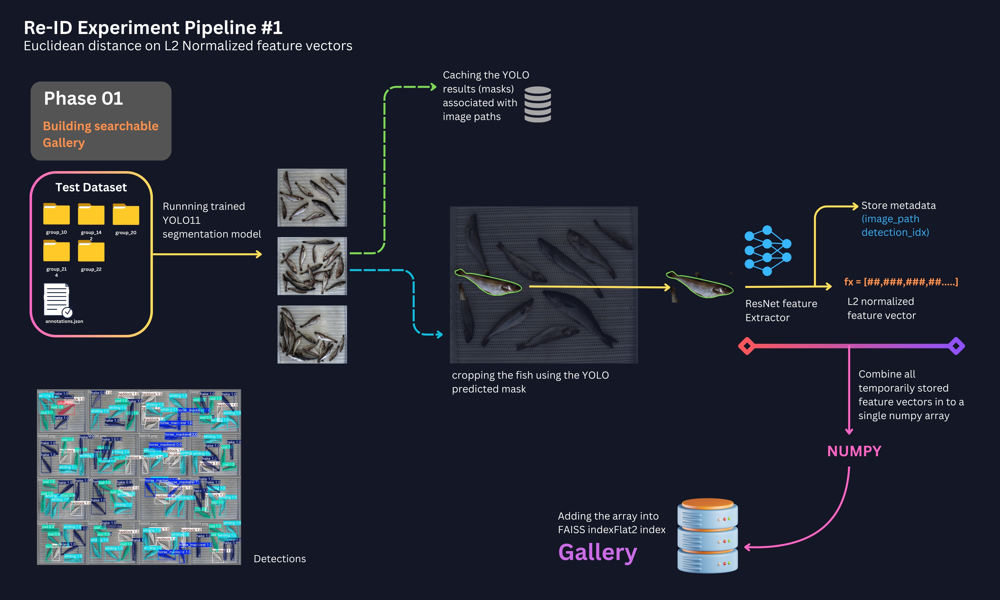
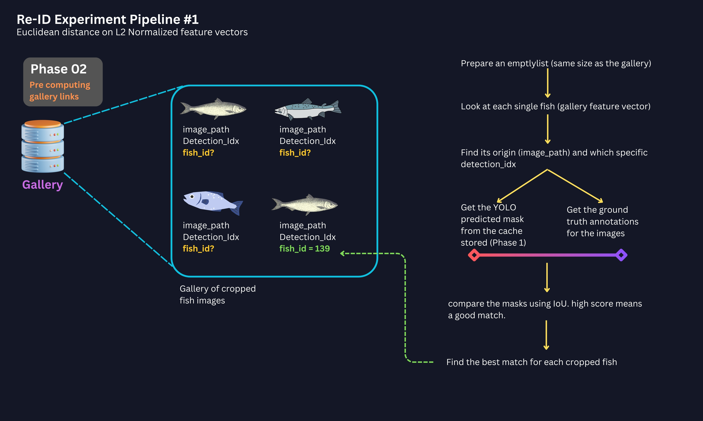

## Initial Re-Identification experiment using Ranking based on L2 normlized Vectors on Euclidian distance





## Ranking results (ResNet50)
- Rank-1  Accuracy: 35.86%
   - roughly 1 out of 3 times, the very best match the system finds (excluding the query photo itself) is the correct fish. 
- Rank-5  Accuracy: 57.05%
   - more than half the time, the correct fish appears somewhere within the top 5 most similar results
- Rank-10 Accuracy: 68.04%
   - over two thirds of tthe time, the correct fish is found within the top 10 results.


```text
## Important Parameter definitions i used in the process below
### 1. IoU_THRESHOLD = 0.9
   sets the minimum required overlap (Intersection over Union) when matching a YOLO predicted mask to a Ground truth mask (GT)
   This threshold is used in two places in the pipeline

   1. Pre-computing links - When linking a gallery detection (from YOLO) back to a GT "fish_ID", the GT mask must be at least 90%. if the best overlap is less than this, the script assumes the yolo detection doesnt correspond well enough to any known fish, and it assigns "None" as the linked ID for that gallery item
   2. Query selction - when start with a GT fish annotation to form a query, the script finds the yolo mask in that image that best overlaps with it. If that best overlap is less than 0.9, the script decides the specific GT fish wasnt detected reliably enough by YOLO to be used as aquery. IT skips processing that particular query instance and move to the next.
  
### 2. YOLO_CONF = 0.25

Standard yolo parameter defining the minimum confidence score a detection must have to be considered as valid.

### 3. YOLO_IOU = 0.5

This is yolo non max suppression (NMS) IoU threshold. 

### 4. K_NEIGHBOURS = 50
specified how many potentially similar items to retrieve from the FAISS index during the search step (faiss_index_search())
In here when we search FAISS with a query feature, this parameter tells FAISS to return the top 50 gallery items whose features are closest (most similar( to the query feature.
This is needed to be more than the final rank that we want to evaluate because here it skips the self match instance.

### 5. EVAL_K = 50
Defines maximum rank (k) up to which i want to calculate and potentially report the re-id accuracy

```
## Script

The script follows the above phases described visually in the diagrams above

```python
import os
import json
import cv2
import numpy as np
from PIL import Image
from collections import defaultdict, namedtuple
import time

import torch
import torch.nn as nn
import torch.nn.functional as F
from torchvision import transforms
from torchvision.models import resnet50, ResNet50_Weights
import faiss
from ultralytics import YOLO

# --- Configuration ---
DEVICE = "cuda" if torch.cuda.is_available() else "cpu"
print(f"Using device: {DEVICE}")

# --- Paths ---
BASE_PATH     = "/work3/msam/Thesis/autofish/" 
COCO_ANN_PATH = os.path.join(BASE_PATH, "annotations.json") 
YOLO_WEIGHTS  = "/work3/msam/Thesis/segmentation/multiple_init_results/init_9/init_9/weights/best.pt" 

# --- Parameters ---
TEST_GROUPS   = ["group_10", "group_14", "group_20", "group_21", "group_22"] # Groups for test set gallery/queries
IOU_THRESHOLD = 0.9       # IoU threshold for matching predicted masks to GT masks
YOLO_CONF     = 0.25      # YOLO confidence threshold
YOLO_IOU      = 0.9       # YOLO NMS IoU threshold
K_NEIGHBORS   = 50        # How many neighbors to retrieve from FAISS (more than final eval K)
EVAL_K        = 50        # Evaluate up to Rank-K (e.g., R1, R5, R10)

# --- Feature Extractor Selection ---
# In this test, i used resnet_50
EXTRACTOR_TYPE = 'resnet_50' # Options: 'resnet50', 'swin_t', 'dinov2_vits14'

if EXTRACTOR_TYPE == 'resnet50':
    FEAT_DIM = 2048
elif EXTRACTOR_TYPE == 'swin_t':
    FEAT_DIM = 768 # Swin-T output dim
elif EXTRACTOR_TYPE == 'dinov2_vits14':
    FEAT_DIM = 384 # DINOv2 ViT-Small output dim
else:
    raise ValueError("Unsupported extractor type")

# --- Data Structures ---
# Holds info for each item ADDED to the gallery index
GalleryInfo = namedtuple("GalleryInfo", ["image_path", "detection_idx", "feature_index"])

# --- Model Loading ---

# YOLO Model
print("Loading YOLO model...")
try:
    yolo_model = YOLO(YOLO_WEIGHTS)
    yolo_model.to(DEVICE) # Move model to device
    print("YOLO model loaded successfully.")
except Exception as e:
    print(f"Error loading YOLO model from {YOLO_WEIGHTS}: {e}")
    exit()

# Feature Extractor -- this test resnet_50
print(f"Loading Feature Extractor: {EXTRACTOR_TYPE}...")
if EXTRACTOR_TYPE == 'resnet50':
    feature_extractor = resnet50(weights=ResNet50_Weights.IMAGENET1K_V2) # Use newer weights API
    feature_extractor.fc = nn.Identity() # Remove classification head
elif EXTRACTOR_TYPE == 'swin_t':
    # Requires timm: pip install timm
    import timm
    feature_extractor = timm.create_model('swin_tiny_patch4_window7_224', pretrained=True)
    feature_extractor.head = nn.Identity()
elif EXTRACTOR_TYPE == 'dinov2_vits14':
    # Requires torch.hub and potentially cloning DINOv2 repo depending on setup
    # This might need internet access first time
    try:
       feature_extractor = torch.hub.load('facebookresearch/dinov2', 'dinov2_vits14')
    except Exception as e:
       print(f"Could not load DINOv2 via torch.hub: {e}")
       print("Please ensure you have internet or have the model cached.")
       exit()
else:
     raise ValueError("Unsupported extractor type")

feature_extractor.eval()
feature_extractor.to(DEVICE)
print("Feature extractor loaded successfully.")

# Preprocessing Transform 
IMG_SIZE = 224 
transform = transforms.Compose([
    transforms.Resize((IMG_SIZE, IMG_SIZE)),
    transforms.ToTensor(),
    transforms.Normalize(mean=[0.485, 0.456, 0.406], std=[0.229, 0.224, 0.225])
])

# --- Helper Functions ---

def get_image_paths(base_path, groups):
    # Gets list of full image paths for the specified groups.
    paths = []
    print(f"Searching for images in groups: {groups} within {base_path}")
    for group in groups:
        group_path = os.path.join(base_path, group)
        if os.path.isdir(group_path):
            count = 0
            for fname in sorted(os.listdir(group_path)): # Sort for consistency
                 if fname.lower().endswith(('.jpg', '.jpeg', '.png')):
                     paths.append(os.path.join(group_path, fname))
                     count += 1
            print(f"  Found {count} images in {group}")
        else:
            print(f"  Warning: Group folder not found: {group_path}")
    print(f"Total images found across specified groups: {len(paths)}")
    return paths

def extract_feature_from_mask(img_np, mask_np, feature_extractor, transform):
    # Extracts feature from an image region defined by a binary mask.
    if mask_np.sum() == 0: # Empty mask
        return None

    mask_bin = (mask_np > 0).astype(np.uint8) * 255
    img_h, img_w = img_np.shape[:2]

    # Resize mask if needed (YOLO might output different size)
    if mask_bin.shape[:2] != (img_h, img_w):
         mask_bin = cv2.resize(mask_bin, (img_w, img_h), interpolation=cv2.INTER_NEAREST) # cv2 resize takes (w, h)

    # Ensure 3 channels for bitwise_and
    if len(img_np.shape) == 2: # Grayscale image? Convert to BGR
        img_np = cv2.cvtColor(img_np, cv2.COLOR_GRAY2BGR)
    if len(mask_bin.shape) == 2:
         mask_3ch = cv2.cvtColor(mask_bin, cv2.COLOR_GRAY2BGR)
    else:
         mask_3ch = mask_bin # Assume it's already 3 channels? Check this.


    masked_img = cv2.bitwise_and(img_np, mask_3ch)

    # Crop tightly around the mask
    y_coords, x_coords = np.where(mask_bin > 0)
    if len(y_coords) == 0: return None # Handle cases where mask becomes empty after resize?
    y_min, y_max = y_coords.min(), y_coords.max()
    x_min, x_max = x_coords.min(), x_coords.max()
    fish_crop = masked_img[y_min:y_max+1, x_min:x_max+1]

    if fish_crop.size == 0:
        return None

    # Convert to PIL (RGB), transform, extract feature
    try:
        fish_pil = Image.fromarray(cv2.cvtColor(fish_crop, cv2.COLOR_BGR2RGB)).convert("RGB")
    except: # Handle potential conversion issues if crop is strange
        return None

    tensor_in = transform(fish_pil).unsqueeze(0).to(DEVICE)
    with torch.no_grad():
        feat = feature_extractor(tensor_in)
    return feat.cpu().numpy()


def calculate_iou(mask1, mask2):
    # Calculates IoU between two binary masks (numpy arrays, HxW).
    if mask1.shape != mask2.shape:
        # print(f"Warning: Mask shape mismatch for IoU: {mask1.shape} vs {mask2.shape}. Resizing second mask.")
        mask2 = cv2.resize(mask2.astype(np.uint8), (mask1.shape[1], mask1.shape[0]), interpolation=cv2.INTER_NEAREST)

    mask1_bool = mask1 > 0
    mask2_bool = mask2 > 0
    intersection = np.logical_and(mask1_bool, mask2_bool).sum()
    union = np.logical_or(mask1_bool, mask2_bool).sum()
    if union == 0:
        return 0.0
    return intersection / union

def load_coco_annotations(coco_path, base_img_path):
    # Loads COCO annotations and builds useful mappings.
    print(f"Loading annotations from {coco_path}...")
    if not os.path.exists(coco_path):
        print(f"Error: Annotation file not found at {coco_path}")
        exit()
    try:
        with open(coco_path, 'r') as f:
            coco_data = json.load(f)
    except json.JSONDecodeError as e:
        print(f"Error reading JSON file {coco_path}: {e}")
        exit()
    except Exception as e:
        print(f"An unexpected error occurred loading {coco_path}: {e}")
        exit()

    print("Building annotation mappings...")
    imgid_to_filepath = {}
    imgfilepath_to_id = {}
    for img in coco_data.get('images', []):
        img_path = os.path.join(base_img_path, img['file_name'])
        imgid_to_filepath[img['id']] = img_path
        imgfilepath_to_id[img_path] = img['id']


    imgid_to_annotations = defaultdict(list)
    annid_to_annotation = {}
    for ann in coco_data.get('annotations', []):
        imgid_to_annotations[ann['image_id']].append(ann)
        annid_to_annotation[ann['id']] = ann

    print(f"Loaded {len(coco_data.get('annotations', []))} annotations for {len(coco_data.get('images', []))} images.")
    return coco_data, imgid_to_filepath, imgfilepath_to_id, imgid_to_annotations, annid_to_annotation

def get_gt_mask(annotation, img_h, img_w):
    # Creates a binary mask from a COCO annotation (polygon or RLE)
    mask = np.zeros((img_h, img_w), dtype=np.uint8)
    seg = annotation['segmentation']
    if isinstance(seg, list): # Polygon
         for poly in seg:
             try:
                poly_np = np.array(poly, dtype=np.int32).reshape(-1, 2)
                cv2.fillPoly(mask, [poly_np], 1)
             except ValueError:
                 # print(f"Warning: Skipping malformed polygon in ann {annotation['id']}")
                 continue # Skip malformed polygons
    elif isinstance(seg, dict): # RLE (requires pycocotools)
        try:
            from pycocotools import mask as mask_utils
            rle = mask_utils.frPyObjects(seg, img_h, img_w)
            mask = mask_utils.decode(rle)
            if len(mask.shape) > 2: # Handle potential multi-channel decode
                mask = mask[..., 0] # Assume first channel
            mask = mask.astype(np.uint8) # Ensure correct type
        except ImportError:
            print("Warning: pycocotools not installed. Cannot decode RLE masks.")
            return None # Indicate failure if RLE and no pycocotools
        except Exception as e:
            print(f"Error decoding RLE for ann {annotation['id']}: {e}")
            return None
    else:
        # print(f"Warning: Unsupported segmentation format for ann {annotation['id']}")
        return None # Indicate failure for unsupported format

    return mask


# --- Main Workflow ---
if __name__ == "__main__":
    start_time = time.time()

    # 1. Load GT Annotations (Needed for evaluation linkage and query selection)
    coco_data, imgid_to_filepath, imgfilepath_to_id, imgid_to_annotations, annid_to_annotation = \
        load_coco_annotations(COCO_ANN_PATH, BASE_PATH)

    # 2. Gallery Construction
    print("\n--- Building Gallery ---")
    gallery_image_paths = get_image_paths(BASE_PATH, TEST_GROUPS)
    gallery_features_list = []
    gallery_metadata = [] # List of GalleryInfo tuples
    faiss_index = faiss.IndexFlatL2(FEAT_DIM) # L2 distance index
    current_feature_index = 0
    yolo_gallery_cache = {} # Cache YOLO results for gallery images

    for i, img_path in enumerate(gallery_image_paths):
        if i % 50 == 0: print(f"  Processing gallery image {i+1}/{len(gallery_image_paths)}: {os.path.basename(img_path)}")
        try:
            # --- Run YOLO ---
            # Check cache first
            if img_path in yolo_gallery_cache:
                results = yolo_gallery_cache[img_path]
                img = Image.open(img_path).convert("RGB") # Still need image for cropping
                img_np = np.array(img)
            else:
                img = Image.open(img_path).convert("RGB")
                img_np = np.array(img)
                # Store PIL image in cache if needed later? For now, just results
                results = yolo_model.predict(img, verbose=False, conf=YOLO_CONF, iou=YOLO_IOU, device=DEVICE)
                yolo_gallery_cache[img_path] = results # Cache results

            if len(results) > 0 and results[0].masks is not None:
                masks_data = results[0].masks.data # Tensor of masks [N, H, W]
                masks_np = masks_data.cpu().numpy()

                for det_idx, pred_mask_np in enumerate(masks_np):
                    # --- Extract feature ---
                    feature = extract_feature_from_mask(img_np, pred_mask_np, feature_extractor, transform)

                    if feature is not None:
                        gallery_features_list.append(feature)
                        meta = GalleryInfo(image_path=img_path,
                                           detection_idx=det_idx,
                                           feature_index=current_feature_index)
                        gallery_metadata.append(meta)
                        current_feature_index += 1

        except FileNotFoundError:
            print(f"  Warning: Image file not found (skipped): {img_path}")
        except Exception as e:
            print(f"  Error processing gallery image {img_path}: {e}")

    if not gallery_features_list:
        print("\nError: No features extracted for the gallery. Exiting.")
        exit()

    # --- Add features to FAISS ---
    gallery_features_np = np.concatenate(gallery_features_list, axis=0).astype('float32')
    faiss.normalize_L2(gallery_features_np) # Normalize for FAISS L2 distance -> cosine similarity
    faiss_index.add(gallery_features_np)
    print(f"\nGallery built with {faiss_index.ntotal} features from {len(gallery_image_paths)} images.")
    del gallery_features_list # Free memory

    # 3. Pre-compute Gallery Detection to GT Fish ID links (Optimization)
    print("\n--- Pre-computing Gallery Links ---")
    gallery_linked_fish_ids = [None] * faiss_index.ntotal # Initialize list
    link_time_start = time.time()

    for i, gallery_meta in enumerate(gallery_metadata):
        if i % 200 == 0: print(f"  Linking gallery item {i}/{faiss_index.ntotal}")

        gallery_img_path = gallery_meta.image_path
        gallery_det_idx = gallery_meta.detection_idx

        # Use cached YOLO results
        if gallery_img_path not in yolo_gallery_cache:
             # This shouldn't happen if gallery building worked, but handle just in case
             print(f"  Warning: YOLO results not found in cache for {gallery_img_path}. Skipping linking.")
             continue
        gallery_results = yolo_gallery_cache[gallery_img_path]

        # Get the specific predicted mask
        gallery_pred_mask = None
        try:
            if len(gallery_results) > 0 and gallery_results[0].masks is not None and len(gallery_results[0].masks.data) > gallery_det_idx:
                 gallery_pred_mask = gallery_results[0].masks.data[gallery_det_idx].cpu().numpy()
            else: continue # No mask data or index out of bounds

            if gallery_pred_mask is not None:
                # Need image dimensions for GT mask creation/comparison
                img_id = imgfilepath_to_id.get(gallery_img_path)
                if img_id is None: continue # Image not found in COCO annotations?

                # Find corresponding image info in COCO data
                img_info = next((img for img in coco_data['images'] if img['id'] == img_id), None)
                if img_info is None: continue
                gh, gw = img_info['height'], img_info['width']

                # Process predicted mask: binarize and resize if needed
                gallery_pred_mask_bin = (gallery_pred_mask > 0).astype(np.uint8)
                if gallery_pred_mask_bin.shape[:2] != (gh, gw):
                    gallery_pred_mask_bin = cv2.resize(gallery_pred_mask_bin, (gw, gh), interpolation=cv2.INTER_NEAREST)

                # Find best matching GT annotation
                gt_anns_for_gallery_img = imgid_to_annotations.get(img_id, [])
                best_gallery_iou = -1
                best_matching_gt_ann = None

                for gallery_gt_ann in gt_anns_for_gallery_img:
                    gt_mask = get_gt_mask(gallery_gt_ann, gh, gw)
                    if gt_mask is None: continue # Skip if GT mask couldn't be created

                    iou = calculate_iou(gallery_pred_mask_bin, gt_mask)
                    if iou > best_gallery_iou:
                        best_gallery_iou = iou
                        best_matching_gt_ann = gallery_gt_ann

                # Store linked fish_id if IoU is sufficient
                if best_gallery_iou >= IOU_THRESHOLD:
                     fish_id = best_matching_gt_ann.get("fish_id")
                     if fish_id is not None: # Only link if fish_id exists
                        gallery_linked_fish_ids[i] = fish_id

        except Exception as link_e:
            print(f"  Error during linking for gallery item {i} ({gallery_img_path}): {link_e}")

    print(f"Finished pre-computing links in {time.time() - link_time_start:.2f} seconds.")
    del yolo_gallery_cache # Free memory


    # 4. Query Selection & Evaluation
    print("\n--- Starting Querying and Evaluation ---")
    all_true_query_fish_ids = []
    all_retrieved_gallery_fish_ids_ranked = [] # List of lists for Rank-k calc
    num_queries_processed = 0
    num_queries_failed_match = 0
    num_queries_no_feature = 0
    query_time_start = time.time()
    yolo_query_cache = {} # Cache YOLO results for query images


    # Iterate through GT annotations of TEST SET images to define queries
    test_img_ids = {img_id for img_path, img_id in imgfilepath_to_id.items() if any(group in img_path for group in TEST_GROUPS)}
    print(f"Processing queries from {len(test_img_ids)} test images...")

    processed_query_count = 0
    for img_id in test_img_ids:
        img_path = imgid_to_filepath.get(img_id)
        if not img_path: continue

        processed_query_count += 1
        if processed_query_count % 20 == 0: print(f" Processing queries from image {processed_query_count}/{len(test_img_ids)}")

        # Get YOLO results for the query image (use cache)
        if img_path not in yolo_query_cache:
             try:
                 img = Image.open(img_path).convert("RGB")
                 results = yolo_model.predict(img, verbose=False, conf=YOLO_CONF, iou=YOLO_IOU, device=DEVICE)
                 yolo_query_cache[img_path] = (results, img.size) # Cache results and size
             except Exception as e:
                 print(f" Error running YOLO on query image {img_path}: {e}")
                 yolo_query_cache[img_path] = ([], (0,0)) # Mark as failed
                 continue
        query_results, (qw, qh) = yolo_query_cache[img_path]


        pred_masks_np = []
        if len(query_results) > 0 and query_results[0].masks is not None:
             pred_masks_np = query_results[0].masks.data.cpu().numpy()

        # Match GT annotations to YOLO predictions for this image
        gt_anns_for_image = imgid_to_annotations.get(img_id, [])
        for gt_ann in gt_anns_for_image:
            true_fish_id = gt_ann.get("fish_id")
            if true_fish_id is None: continue # Skip GT annotations without fish_id

            # Get GT mask for this annotation
            gt_mask = get_gt_mask(gt_ann, qh, qw) # Use cached dimensions
            if gt_mask is None: continue

            # Find best matching predicted mask
            best_iou = -1
            best_pred_mask_idx = -1
            best_pred_mask = None # Store the mask itself

            for det_idx, pred_mask in enumerate(pred_masks_np):
                pred_mask_bin = (pred_mask > 0).astype(np.uint8)
                if pred_mask_bin.shape[:2] != (qh, qw):
                     pred_mask_bin = cv2.resize(pred_mask_bin, (qw, qh), interpolation=cv2.INTER_NEAREST)

                iou = calculate_iou(gt_mask, pred_mask_bin)
                if iou > best_iou:
                    best_iou = iou
                    best_pred_mask_idx = det_idx
                    best_pred_mask = pred_mask # Store the raw predicted mask


            # If a good match is found, use this as a query
            if best_iou >= IOU_THRESHOLD:
                try:
                    query_img = Image.open(img_path).convert("RGB") # Reload for cropping (could optimize)
                    query_img_np = np.array(query_img)
                    query_feature = extract_feature_from_mask(query_img_np, best_pred_mask, feature_extractor, transform)

                    if query_feature is not None:
                        num_queries_processed += 1
                        faiss.normalize_L2(query_feature.astype('float32')) # Ensure normalization & type

                        # --- Perform Search ---
                        # Ensure K is not larger than the index size
                        current_k = min(K_NEIGHBORS, faiss_index.ntotal)
                        distances, indices = faiss_index.search(query_feature, current_k)

                        # --- Evaluation Linkage (using pre-computed links) ---
                        retrieved_ids_for_query = []
                        query_source_info = (img_path, best_pred_mask_idx)

                        processed_neighbors = 0
                        for k_rank in range(current_k): # Iterate through FAISS results
                            gallery_original_index = indices[0][k_rank] # Index in the full gallery
                            gallery_meta = gallery_metadata[gallery_original_index]

                            # *** Exclude exact self-match ***
                            if gallery_meta.image_path == query_source_info[0] and gallery_meta.detection_idx == query_source_info[1]:
                                continue

                            # *** Direct Lookup of pre-computed link ***
                            linked_id = gallery_linked_fish_ids[gallery_original_index]
                            retrieved_ids_for_query.append(linked_id) # Append ID (could be None)

                            processed_neighbors += 1
                            # Stop if we have enough results for evaluation (e.g., top EVAL_K non-self)
                            if processed_neighbors >= EVAL_K:
                                break

                        # Store results for this query
                        all_true_query_fish_ids.append(true_fish_id)
                        all_retrieved_gallery_fish_ids_ranked.append(retrieved_ids_for_query)
                    else:
                         num_queries_no_feature += 1
                except Exception as query_proc_e:
                    print(f" Error processing query ann {gt_ann['id']} from {img_path}: {query_proc_e}")

            else: # No good YOLO mask match for this GT annotation
                 num_queries_failed_match +=1


    print(f"\nFinished querying and evaluation in {time.time() - query_time_start:.2f} seconds.")
    print(f"  Total GT annotations processed as potential queries: approx {sum(len(v) for k,v in imgid_to_annotations.items() if k in test_img_ids)}")
    print(f"  Successfully processed queries (feature extracted): {num_queries_processed}")
    print(f"  Queries skipped (no good YOLO match to GT): {num_queries_failed_match}")
    print(f"  Queries skipped (feature extraction failed): {num_queries_no_feature}")

    # 5. Calculate Rank-k Accuracy
    def calculate_rank_k(true_ids, retrieved_ids_ranked, k):
        if not true_ids: return 0.0
        hits = 0
        count = 0
        for true_id, retrieved in zip(true_ids, retrieved_ids_ranked):
            # Consider only the top 'k' retrieved IDs that are not None
            top_k_valid_retrieved = [rid for rid in retrieved[:k] if rid is not None]
            if true_id in top_k_valid_retrieved:
                hits += 1
            count += 1 # Count every query processed
        return hits / count if count > 0 else 0.0

    if num_queries_processed > 0:
        print(f"\n--- Re-ID Results ({EXTRACTOR_TYPE} Features / YOLO Segmentation) ---")
        for k_val in [1, 5, 10]:
             if k_val <= EVAL_K: # Only calculate if we retrieved enough neighbors
                 rank_k_acc = calculate_rank_k(all_true_query_fish_ids, all_retrieved_gallery_fish_ids_ranked, k_val)
                 print(f"  Rank-{k_val:<2} Accuracy: {rank_k_acc * 100:.2f}%")
    else:
        print("\nNo queries were successfully processed for evaluation. Cannot calculate accuracy.")

    total_time = time.time() - start_time
    print(f"\nTotal script execution time: {total_time:.2f} seconds ({total_time/60:.2f} minutes)")

```
