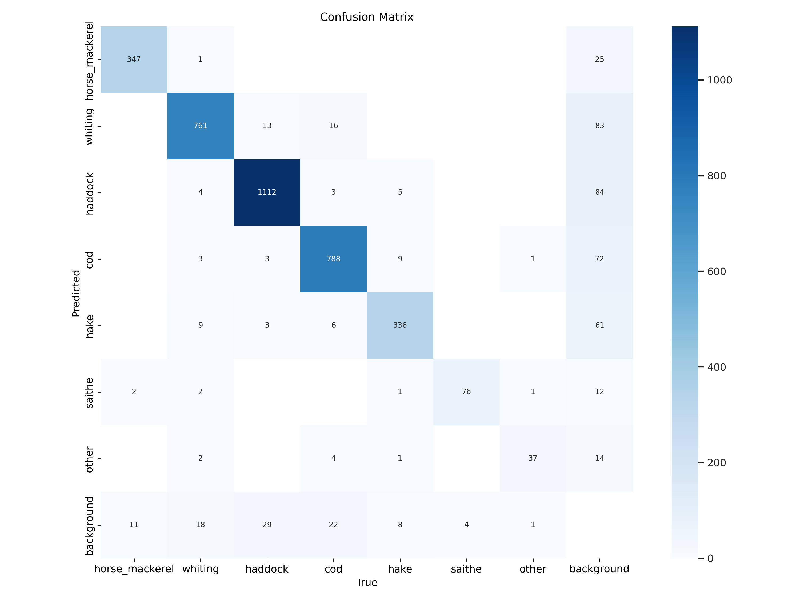
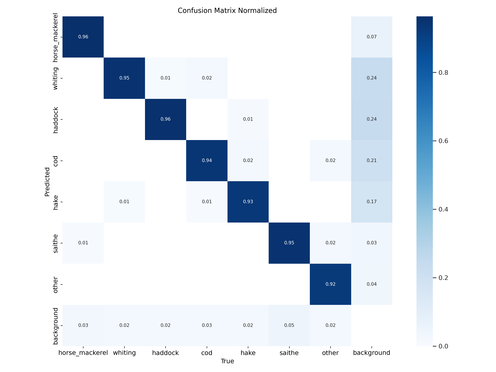

# Training YOLO-segementation models for the segmentation masks in the annotations


## COCO format provides 
- segmentation masks as polygons using absolute pixel coordinates  
- uses JSON format with a list of (x,y) points that form the contour
- "segmentation": [[x1,y1, x2,y2, x3,y3, ...]]

## YOLO format
- stores segmentation masks as normalized coordinates (0-1)
- use plain txt format (.txt) with space separated values
- format per line class_id x1 y1 x2 y2 ... xn yn
- coordinates are normalized by image width and height
  


## steps for the trainins

1. Making a separate YOLO-seg model compatible dataset for the training

```python
import json
import os
import shutil
from pathlib import Path

# Defining Paths
coco_path = f"/work3/msam/Thesis/autofish/annotations.json"
image_groups_dir = f"/work3/msam/Thesis/autofish"
output_base_dir = f"/work3/msam/Thesis/segmentation/yolodataset_seg"  # Changed name for segmentation
os.makedirs(output_base_dir, exist_ok=True)

# Keeping the original split as paper
train_groups = {2, 3, 4, 5, 7, 8, 9, 12, 13, 15, 16, 18, 19, 23, 24}
val_groups   = {1, 6, 11, 17, 25}
test_groups  = {10, 14, 20, 21, 22}

# Creating output directories for each split
for split in ["train", "val", "test"]:
    os.makedirs(os.path.join(output_base_dir, split, "images"), exist_ok=True)
    os.makedirs(os.path.join(output_base_dir, split, "labels"), exist_ok=True)

### function to convert COCO format to YOLO format in segmentation masks
def convert_segmentation_to_yolo(segmentation, img_width, img_height):
   
    # Get the polygon from segmentation
    polygon = segmentation[0]
    normalized_coords = []
    
    # Convert each pair of coordinates
    for i in range(0, len(polygon), 2):
        # Normalize x coordinate
        x = polygon[i] / img_width
        # Normalize y coordinate
        y = polygon[i + 1] / img_height
        
        # Ensure coordinates are within [0, 1]
        x = min(max(x, 0), 1)
        y = min(max(y, 0), 1)
        
        normalized_coords.extend([x, y])
    
    return normalized_coords

### dataset processing function
def process_dataset(coco_path, image_groups_dir, output_base_dir):
    # Load COCO annotations
    with open(coco_path, "r") as f:
        data = json.load(f)
    
    # Build a mapping from image_id to its annotations for quick lookup
    annotations_by_image = {}
    for ann in data["annotations"]:
        img_id = ann["image_id"]
        annotations_by_image.setdefault(img_id, []).append(ann)
    
    # Process each image defined in the original annotations
    for img in data["images"]:
        img_id = img["id"]
        file_name = img["file_name"]  # e.g., "group_03/00001.jpg"
        parts = file_name.split('/')
        if len(parts) < 2:
            print(f"Warning: File name format is unexpected: {file_name}")
            continue
        
        # Extract the group folder and original file name
        group_folder = parts[0]         # e.g., "group_03"
        original_filename = parts[-1]   # e.g., "00001.jpg"
        
        # Parse the group number
        try:
            group_num = int(group_folder.split('_')[-1])
        except ValueError:
            print(f"Warning: Could not parse group number from {group_folder}")
            continue
        
        # Determine the dataset split based on the group number
        if group_num in train_groups:
            split = "train"
        elif group_num in val_groups:
            split = "val"
        elif group_num in test_groups:
            split = "test"
        else:
            print(f"Warning: Group number {group_num} is not assigned to any split folder.")
            continue
        
        # Build paths
        src_img_path = os.path.join(image_groups_dir, file_name)
        dest_img_dir = os.path.join(output_base_dir, split, "images", group_folder)
        os.makedirs(dest_img_dir, exist_ok=True)
        
        dest_img_filename = original_filename
        dest_img_path = os.path.join(dest_img_dir, dest_img_filename)
        
        # Copy the image file if it exists
        if os.path.exists(src_img_path):
            shutil.copy2(src_img_path, dest_img_path)
        else:
            print(f"Warning: Source image {src_img_path} does not exist.")
        
        # Process annotations for this image
        anns = annotations_by_image.get(img_id, [])
        yolo_lines = []
        for ann in anns:
            # Convert segmentation coordinates to YOLO format
            normalized_coords = convert_segmentation_to_yolo(
                ann["segmentation"],
                img["width"],
                img["height"]
            )
            
            # Format: class_id x1 y1 x2 y2 ...
            category_id = ann["category_id"]
            coords_str = " ".join([f"{coord:.6f}" for coord in normalized_coords])
            yolo_lines.append(f"{category_id} {coords_str}")
        
        # Save YOLO annotations if available
        if yolo_lines:
            dest_label_dir = os.path.join(output_base_dir, split, "labels", group_folder)
            os.makedirs(dest_label_dir, exist_ok=True)
            label_filename = f"{Path(original_filename).stem}.txt"
            label_path = os.path.join(dest_label_dir, label_filename)
            with open(label_path, "w") as f:
                f.write("\n".join(yolo_lines))
    
    # Create dataset.yaml file
    yaml_content = f"""
path: {output_base_dir}
train: train/images
val: val/images
test: test/images

# Classes
names:
{chr(10).join(f'  {i}: {cat["name"]}' for i, cat in enumerate(data['categories']))}

# Whether to use segmentation
task: segment
    """
    with open(os.path.join(output_base_dir, "dataset.yaml"), "w") as f:
        f.write(yaml_content.strip())
    
    print("Dataset processing done")

# Run the Processing
if __name__ == "__main__":
    process_dataset(coco_path, image_groups_dir, output_base_dir)
```
Check if the conversion is good in the YOLO format
```python
#confirming the masks are okay
import matplotlib.pyplot as plt
import matplotlib.patches as patches
from PIL import Image

# path for the random selected image
image_path = f"/work3/msam/Thesis/segmentation/yolodataset_seg/train/images/group_02/00001.png" 
label_path = f"/work3/msam/Thesis/segmentation/yolodataset_seg/train/labels/group_02/00001.txt" 

# Open the image using PIL and get its size
image = Image.open(image_path)
width, height = image.size

# Create a figure and axis
fig, ax = plt.subplots(1)
ax.imshow(image)

# Read the YOLO label file
with open(label_path, 'r') as f:
    for line in f:
        line = line.strip()
        if not line:
            continue

        parts = line.split()
        category_id = int(parts[0])  # Use as needed
        coords = list(map(float, parts[1:]))

        # Convert normalized coordinates to pixel coordinates and build the polygon points
        polygon_points = []
        for i in range(0, len(coords), 2):
            x_pixel = coords[i] * width
            y_pixel = coords[i + 1] * height
            polygon_points.append((x_pixel, y_pixel))

        # Create and add the polygon patch to the axis
        polygon = patches.Polygon(polygon_points, closed=True, fill=True, edgecolor='yellow', linewidth=2)
        ax.add_patch(polygon)

# Display the image with the overlaid polygons
plt.title("YOLO Segmentation ")
plt.axis('off')
plt.show()
```


# Training with Pretrained YOLO v11 segmentation model (Large architecture)
The model was trained using the Autofish dataset with the similar configuration of train/val/test split
The training was intialize 10 times to account for the variability in performance of the model.
The multi-step learning schedular was not used in here as the paper, instead i used the start and final learning rate.

## Combined Configuration of fish (60 images per folder)

```python

from ultralytics import YOLO
import torch
import os
import pandas as pd
import numpy as np
from typing import Dict, List
from datetime import datetime

# Defining the Paths
data_path = "/work3/msam/Thesis/segmentation/yolodataset_seg/dataset.yaml"
model_path = "yolo11l-seg.pt"
output_dir = "/work3/msam/Thesis/segmentation/multiple_init_results"
os.makedirs(output_dir, exist_ok=True)

# Defining Training parameters
hyperparameters = {
    "epochs": 300,
    "batch_size": 32,
    "img_size": 640,
    "device": 0,
    "optimizer": "AdamW",
    "n_initializations": 10
}

### Model training function
def train_single_initialization(model_path: str, data_path: str, output_dir: str, seed: int) -> Dict:
    
    #Train a single initialization
    
    # Create directory for this initialization
    init_dir = os.path.join(output_dir, f'init_{seed}')
    os.makedirs(init_dir, exist_ok=True)
    
    # Log file for this initialization
    log_file = os.path.join(init_dir, 'training_log.txt')
    with open(log_file, 'w') as f:
        f.write(f"Starting initialization {seed} at {datetime.now()}\n")
    
    # Set random seed
    torch.manual_seed(seed)
    
    try:
        # Initialize model
        model = YOLO(model_path)
        
        # Train model
        results = model.train(
            data=data_path,
            epochs=hyperparameters["epochs"],
            imgsz=hyperparameters["img_size"],
            batch=hyperparameters["batch_size"],
            optimizer=hyperparameters["optimizer"],
            device=hyperparameters["device"],
            project=init_dir,
            name=f"init_{seed}",
            lr0=0.01,      # initial learning rate
            lrf=0.00001    # final learning rate
        )
        
        # Validate model
        val_results = model.val(
            data=data_path,
            imgsz=hyperparameters["img_size"],
            save_json=True,
            save_conf=True
        )
        
        # Store metrics
        metrics = {
            'initialization': seed,
            'mAP50': float(val_results.seg.map50),
            'mAP50-95': float(val_results.seg.map),
            'precision': float(val_results.seg.mp),
            'recall': float(val_results.seg.mr)
        }
        
        # Log completion
        with open(log_file, 'a') as f:
            f.write(f"Completed initialization {seed} at {datetime.now()}\n")
            f.write(f"Metrics: {metrics}\n")
        
        # Clean up
        del model
        torch.cuda.empty_cache()
        
        return metrics
        
    except Exception as e:
        # Log error
        with open(log_file, 'a') as f:
            f.write(f"Error in initialization {seed}: {str(e)}\n")
        raise e

### Function to calculate statistics for overall performance in all random model initializations
def calculate_statistics(results: List[Dict]) -> pd.DataFrame:
    
    df = pd.DataFrame(results)
    
    # Calculate statistics for each metric
    stats = []
    for metric in ['mAP50', 'mAP50-95', 'precision', 'recall']:
        values = df[metric].values
        stats.append({
            'metric': metric,
            'mean': np.mean(values),
            'std': np.std(values),
            'min': np.min(values),
            'max': np.max(values),
            'confidence_95': 1.96 * np.std(values) / np.sqrt(len(values))
        })
    
    return pd.DataFrame(stats)

### Main function
def main():
    print("\nStarting Multiple Initialization Training")
    print("="*50)
    print(f"Training Parameters:")
    print(f"Initial LR: 0.01")
    print(f"Final LR: 0.00001")
    print(f"Epochs: {hyperparameters['epochs']}")
    print("="*50)
    
    # Store all results
    all_results = []
    
    # Run initializations
    for init in range(hyperparameters['n_initializations']):
        print(f"\nStarting initialization {init + 1}/{hyperparameters['n_initializations']}")
        
        try:
            # Train and get metrics
            metrics = train_single_initialization(model_path, data_path, output_dir, seed=init)
            all_results.append(metrics)
            
            # Save current results
            results_df = pd.DataFrame(all_results)
            results_df.to_csv(os.path.join(output_dir, 'all_initializations.csv'), index=False)
            
            # Print current results
            print(f"\nResults from initialization {init + 1}:")
            for key, value in metrics.items():
                if key != 'initialization':
                    print(f"{key}: {value:.4f}")
            
        except Exception as e:
            print(f"Error in initialization {init}: {e}")
    
    # Calculate and save final statistics
    if all_results:
        print("\nCalculating stats")
        stats_df = calculate_statistics(all_results)
        stats_df.to_csv(os.path.join(output_dir, 'final_statistics.csv'), index=False)
        
        # Print final results
        print("\nFinal Results:")
        print("-"*50)
        for _, row in stats_df.iterrows():
            print(f"\n{row['metric']}:")
            print(f"Mean: {row['mean']:.4f}")
            print(f"Std:  {row['std']:.4f}")
            print(f"95% CI: ±{row['confidence_95']:.4f}")
            print(f"Min:  {row['min']:.4f}")
            print(f"Max:  {row['max']:.4f}")

if __name__ == "__main__":
    main()
```


<p align="center">
  
  
</p>

<p align="center">
  <b>Confusion matrix (instances) </b> &nbsp;&nbsp;&nbsp;&nbsp;&nbsp;&nbsp;&nbsp;&nbsp;&nbsp;&nbsp;
  <b>Normalized confusion matrix </b>
</p>
```

# Testing the trained model performance using the test dataset

Here the classwise performance was evaluated using the following performance metrics and calculated the relavent statistics (mean, SD, SE and Confidence intervals(95%)
- Precision
- Recall
- mean average precision at 0.5 IOU (mAP50)
- mean average precision at IOU 0.5 -0.95 (mAP50-95)


```python
import os
from pathlib import Path
import numpy as np
import pandas as pd
from scipy import stats #calculating CI
from ultralytics import YOLO
import yaml
from datetime import datetime

### Class names loading fuction
# loading class 'names' from yaml file
# mapping numeric class indices to actual class names
# returns an empty list if 'names' isnt found
def load_class_names(yaml_path):
    
    with open(yaml_path, 'r') as f:
        data = yaml.safe_load(f)
        return data.get('names', [])

### Model evaluation function
# loads a custom trained YOLO model from the model path (best.pt)
# Evaluate a single model initialization and return class-wise metrics.
# retuns a dictionary containing metrics for each class, and all classes
def evaluate_model(model_path, test_data_path):
    #path to the best.pt
    model = YOLO(model_path)
    
    # Run validation on test dataset
    results = model.val(
        data=test_data_path,
        conf=0.5,
        iou=0.9,
        verbose=False
    )
    
    metrics = {}
    if hasattr(results, 'box'):
        num_classes = len(results.box.ap_class_index)
        
        # Gather metrics for each class
        for i in range(num_classes):
            p, r, ap50, ap = results.box.class_result(i)
            class_name = f"class_{results.box.ap_class_index[i]}"
            metrics[class_name] = {
                'precision': float(p),
                'recall': float(r),
                'map50': float(ap50),
                'map50_95': float(ap)
            }
        
        # Also store mean metrics for all classes
        metrics['all_classes'] = {
            'precision': float(results.box.mp),
            'recall': float(results.box.mr),
            'map50': float(results.box.map50),
            'map50_95': float(results.box.map)
        }
    
    return metrics

### function to calculate the confidence intervals (95%)
def calculate_confidence_interval(data, confidence=0.95):
    
    array = np.array(data) #converting the input to a numpy array for the numerical operations
    mean = np.mean(array) # mean calculation
    # Calculate confidence interval using t-distribution
    ci = stats.t.interval(
        confidence, #CI 95%
        len(array) - 1, # df (number of samples-1)
        loc=mean, # mean
        scale=stats.sem(array) # SE of mean (SD/ sqrt of sample size)
    )

#returns a dictionary with necessary statistics
    return {
        'mean': mean,
        'ci_lower': ci[0],
        'ci_upper': ci[1],
        'std': np.std(array),
        'min': np.min(array),
        'max': np.max(array)
    }

##### main function  ###########

def main():
    # defining the Paths
    base_dir = Path('/work3/msam/Thesis/segmentation/multiple_init_results')
    test_data = '/work3/msam/Thesis/segmentation/yolodataset_seg/dataset.yaml'
    output_dir = Path('/work3/msam/Thesis/segmentation/test_evaluations')
    output_dir.mkdir(parents=True, exist_ok=True)
    
    # Create a timestamp for unique file naming
    timestamp = datetime.now().strftime('%Y%m%d_%H%M%S')
    
    # Try to load class names from Yaml file
    try:
        class_names = load_class_names(test_data)
        print(f"Loaded class names: {class_names}")
    except Exception as e:
        print(f"Could not load class names: {e}")
        class_names = []
    
    # Dictionary to collect metrics for all initializations
    all_metrics = {}
    
    ## Evaluate each initialization
    print("\nStarting model evaluation across all initializations...")
    print("-" * 80)

    ## model evaluation loop
    # evaluates 10 model initializations
    # collects metrics for each intialization
    # steores results in nested disctionary

    for init in range(10):
        model_path = base_dir / f'init_{init}/init_{init}/weights/best.pt'
        print(f"\nProcessing initialization {init}")
        print(f"Model path: {model_path}")
        
        if model_path.exists():
            try:
                metrics = evaluate_model(model_path, test_data)
                # Store metrics for each class
                for class_name, class_metrics in metrics.items():
                    if class_name not in all_metrics:
                        all_metrics[class_name] = {
                            metric: [] for metric in ['precision', 'recall', 'map50', 'map50_95']
                        }
                    for metric, value in class_metrics.items():
                        all_metrics[class_name][metric].append(value)
            except Exception as e:
                print(f"Error processing initialization {init}:")
                print(f"Error details: {str(e)}")
        else:
            print(f"Warning: Model not found at {model_path}")
    
    ## Calculate statistics and confidence intervals
    results = []
    for class_name, metrics in all_metrics.items():
        for metric_name, values in metrics.items():
            stats_result = calculate_confidence_interval(values)
            results.append({
                'class': class_name,
                'metric': metric_name,
                'mean': stats_result['mean'],
                'ci_lower': stats_result['ci_lower'],
                'ci_upper': stats_result['ci_upper'],
                'std': stats_result['std'],
                'min': stats_result['min'],
                'max': stats_result['max']
            })
    
    # Create DataFrame and save results
    results_df = pd.DataFrame(results)
    
    # Replace class indices with names if available
    if class_names:
        class_map = {f'class_{i}': name for i, name in enumerate(class_names)}
        results_df['class'] = results_df['class'].map(lambda x: class_map.get(x, x))
    
    # Save results to CSV
    results_csv_path = output_dir / f'class_wise_metrics_with_ci_{timestamp}.csv'
    results_df.to_csv(results_csv_path, index=False)
    
    # Print formatted results
    print("\nClass-wise Performance Metrics with 95% Confidence Intervals:")
    print("-" * 80)
    
    # Overall (all_classes) first
    all_results = results_df[results_df['class'] == 'all_classes']
    print("\nOverall Performance:")
    for _, row in all_results.iterrows():
        print(f"{row['metric']:<12} {row['mean']:.3f} "
              f"({row['ci_lower']:.3f} - {row['ci_upper']:.3f})")
    
    # Class-specific
    class_results = results_df[results_df['class'] != 'all_classes']
    for cname in sorted(set(class_results['class'])):
        print(f"\n{cname}:")
        class_data = class_results[class_results['class'] == cname]
        for _, row in class_data.iterrows():
            print(f"{row['metric']:<12} {row['mean']:.3f} "
                  f"({row['ci_lower']:.3f} - {row['ci_upper']:.3f})")
    
    print(f"\nResults saved to: {results_csv_path}")

if __name__ == "__main__":
    main()

```
# Results 
Here the mAP 50-95 is shown with the error margins
| Class_ID        | mAP50-95_% ± SE_% |
|-----------------|-------------------|
| Overall         | 94.39 ± 0.08      |
| Horse Mackerel  | 95.77 ± 0.06      |
| Whiting         | 94.63 ± 0.07      |
| Haddock         | 95.93 ± 0.04      |
| Cod             | 93.20 ± 0.09      |
| Hake            | 94.17 ± 0.10      |
| Saithe          | 93.19 ± 0.13      |
| Other           | 93.82 ± 0.41      |

Detailed results of the performance metrices with the respective 95% confidence intervals

| Class_ID         | Precision (95% CI)       | Recall (95% CI)          | mAP50 (95% CI)            | mAP50-95 (95% CI)           |
|------------------|--------------------------|--------------------------|---------------------------|-----------------------------|
| Overall          | 0.950 (0.945 - 0.956)    | 0.933 (0.928 - 0.938)    | 0.961 (0.959 - 0.963)     | 0.944 (0.942 - 0.946)       |
| Horse Mackerel   | 0.967 (0.963 - 0.970)    | 0.956 (0.954 - 0.959)    | 0.971 (0.970 - 0.972)     | 0.958 (0.956 - 0.959)       |
| Whiting          | 0.951 (0.947 - 0.955)    | 0.933 (0.930 - 0.935)    | 0.955 (0.953 - 0.956)     | 0.946 (0.945 - 0.948)       |
| Haddock          | 0.968 (0.966 - 0.971)    | 0.959 (0.957 - 0.961)    | 0.973 (0.972 - 0.974)     | 0.959 (0.958 - 0.960)       |
| Cod              | 0.966 (0.964 - 0.969)    | 0.918 (0.914 - 0.922)    | 0.960 (0.958 - 0.962)     | 0.932 (0.930 - 0.934)       |
| Hake             | 0.942 (0.935 - 0.949)    | 0.928 (0.921 - 0.935)    | 0.962 (0.959 - 0.964)     | 0.942 (0.939 - 0.944)       |
| Saithe           | 0.907 (0.895 - 0.920)    | 0.938 (0.934 - 0.942)    | 0.943 (0.941 - 0.945)     | 0.932 (0.929 - 0.935)       |
| Other            | 0.951 (0.930 - 0.973)    | 0.900 (0.865 - 0.935)    | 0.965 (0.953 - 0.977)     | 0.938 (0.928 - 0.948)       |


